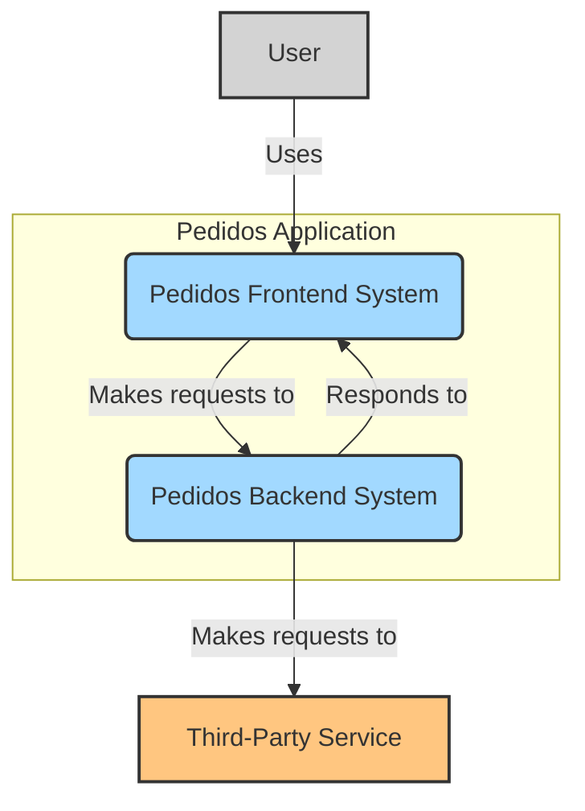
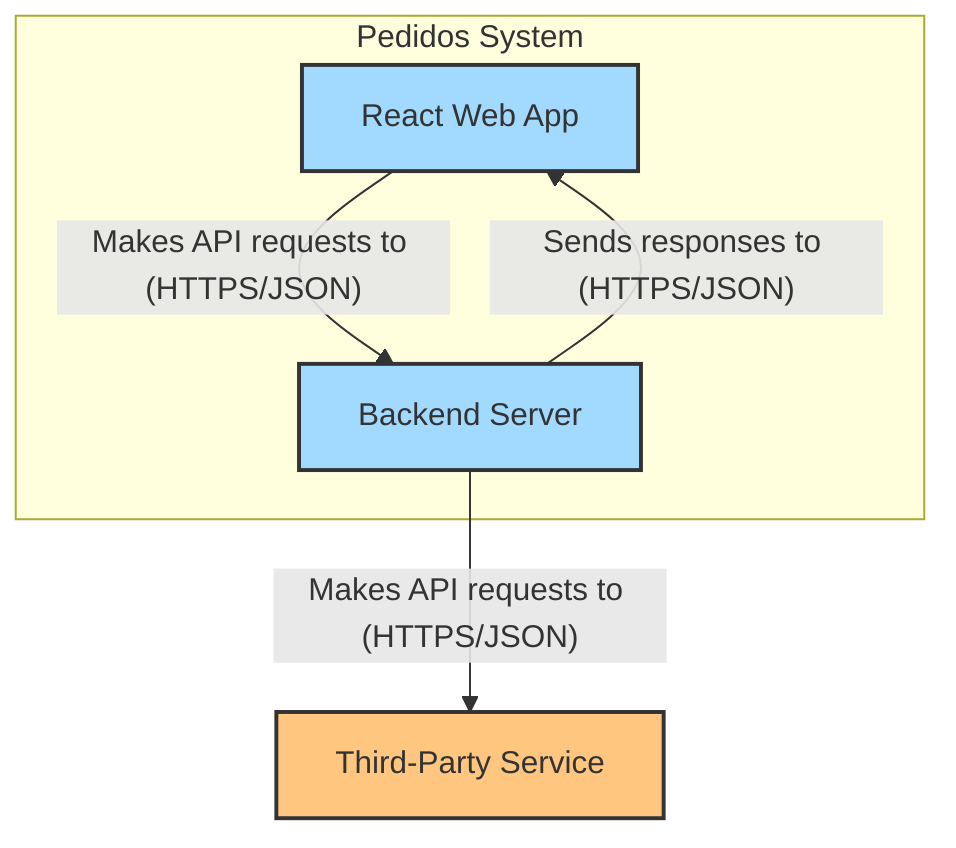
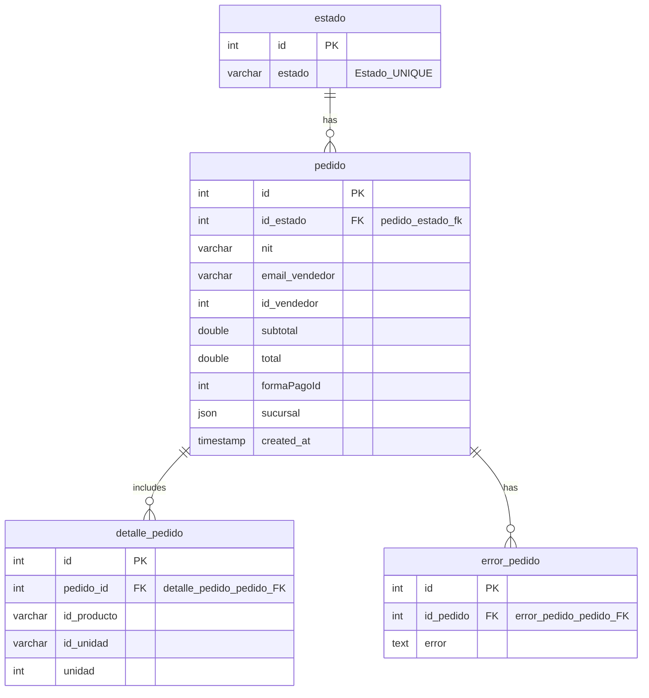

# Arquitectura de la solución
## Diagrama del sistema

```mermaid
graph TD
    %% Define nodes
    User[User]
    ReactWebApp(Pedidos Frontend System)
    BackendServer(Pedidos Backend System)
    ThirdPartyService[Third-Party Service]

    %% Define relationships
    User -- "Uses" --> ReactWebApp
    ReactWebApp -- "Makes requests to" --> BackendServer
    BackendServer -- "Makes requests to" --> ThirdPartyService
    BackendServer -- "Responds to" --> ReactWebApp

    %% Add descriptions (optional, for clarity in Mermaid)
    subgraph Pedidos Application
        ReactWebApp
        BackendServer
    end

    style User fill:#D3D3D3,stroke:#333,stroke-width:2px
    style ReactWebApp fill:#A2D9FF,stroke:#333,stroke-width:2px
    style BackendServer fill:#A2D9FF,stroke:#333,stroke-width:2px
    style ThirdPartyService fill:#FFC680,stroke:#333,stroke-width:2px

```

## Diagrama de contenedor

```mermaid
graph TD
    %% Define nodes for the system boundary
    subgraph Pedidos System
        react_web_app[React Web App]
        backend_server[Backend Server]
    end

    %% Define external system
    third_party_service[Third-Party Service]


    %% Define relationships
    react_web_app -- "Makes API requests to (HTTPS/JSON)" --> backend_server
    backend_server -- "Makes API requests to (HTTPS/JSON)" --> third_party_service
    backend_server -- "Sends responses to (HTTPS/JSON)" --> react_web_app

    %% Styling (optional, for visual distinction)
    style react_web_app fill:#A2D9FF,stroke:#333,stroke-width:2px
    style backend_server fill:#A2D9FF,stroke:#333,stroke-width:2px
    style third_party_service fill:#FFC680,stroke:#333,stroke-width:2px

```

## Modelo entidad relacion

```mermaid
erDiagram
    estado {
        int id PK
        varchar estado "Estado_UNIQUE"
    }

    pedido {
        int id PK
        int id_estado FK "pedido_estado_fk"
        varchar nit
        varchar email_vendedor
        int id_vendedor
        double subtotal
        double total
        int formaPagoId
        json sucursal
        timestamp created_at
    }

    detalle_pedido {
        int id PK
        int pedido_id FK "detalle_pedido_pedido_FK"
        varchar id_producto
        varchar id_unidad
        int unidad
    }

    error_pedido {
        int id PK
        int id_pedido FK "error_pedido_pedido_FK"
        text error
    }

    estado ||--o{ pedido : has
    pedido ||--o{ detalle_pedido : includes
    pedido ||--o{ error_pedido : has
```
